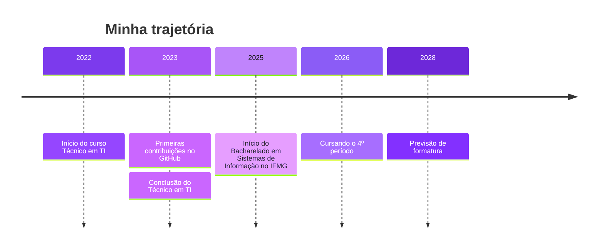

<div align="center">


<a href="https://github.com/IsabellaCarvalh0">
  
</a>

<br/>

<a href="https://www.linkedin.com/in/isabella-carvalho-0a9055236/"></a>
<a href="https://www.instagram.com/isabella_cllm"></a>

</div>

<br/>

## ✦ sobre mim

```yaml
nome:     Isabella Carvalho de Melo
formacao: Bacharelado em Sistemas de Informação (IFMG Sabará)
tecnico:  Técnico em Tecnologia da Informação
stack:    [Java, Python, HTML, CSS, JavaScript, SQL, Git]
foco:     [Desenvolvimento de Software, Automação, IA aplicada]
```

Aqui ficam meus projetos, estudos e experimentos em código.
Se quiser trocar uma ideia, é só chamar nas redes lá embaixo. 💜

> [!NOTE]
> Buscando estágio em desenvolvimento de software, com interesse em Java, automação e IA aplicada.

<br/>

## ✦ tecnologias

<div align="center">


</div>

<br/>

## ✦ trajetória



<details>
<summary><b>Formação</b></summary>
<br/>

- **Bacharelado em Sistemas de Informação**: Instituto Federal de Minas Gerais (IFMG), Campus Sabará. Maio/2025 até dez/2028 (previsão).
- **Técnico em Tecnologia da Informação**: Escola Técnica Sistema Divina Providência, Cidade dos Meninos São Vicente de Paulo. Fev/2022 até dez/2023.

</details>

<details>
<summary><b>Projetos de extensão (IFMG)</b></summary>
<br/>

- **ESCUDO**: ensino e disseminação de informações sobre cibersegurança, com produção de conteúdos técnicos e ações de conscientização em segurança digital.
- **ConectivIDADE**: ensino de informática básica e uso de dispositivos móveis para idosos, adaptando conteúdos a diferentes públicos.

</details>

<details>
<summary><b>Estudando e explorando</b></summary>
<br/>

- Spring Boot e Angular
- Automação de processos
- IA generativa aplicada ao desenvolvimento

</details>

<br/>

## ✦ projetos

<div align="center">
<table>
  <tr>
    <td align="center">
      <a href="https://github.com/IsabellaCarvalh0/ForWomen">
        <h3>💜 ForWomen</h3>
      </a>
      <a href="https://github.com/IsabellaCarvalh0/ForWomen"></a>
      <a href="https://github.com/IsabellaCarvalh0/ForWomen/stargazers"></a>
      <a href="https://github.com/IsabellaCarvalh0/ForWomen/forks"></a>
      <a href="https://github.com/IsabellaCarvalh0/ForWomen/commits"></a>
      <br/><br/>
      <a href="https://github.com/IsabellaCarvalh0/ForWomen"></a>
    </td>
  </tr>
</table>
</div>

<br/>

## ✦ estatísticas

<div align="center">


<br/><br/>


</div>

<br/>

## ✦ contribuições

<div align="center">

<picture>
  <source media="(prefers-color-scheme: dark)" srcset="https://raw.githubusercontent.com/IsabellaCarvalh0/IsabellaCarvalh0/output/github-snake-dark.svg">
  <source media="(prefers-color-scheme: light)" srcset="https://raw.githubusercontent.com/IsabellaCarvalh0/IsabellaCarvalh0/output/github-snake.svg">
  
</picture>

</div>

<br/>

## ✦ vamos conversar

<div align="center">

<a href="https://www.linkedin.com/in/isabella-carvalho-0a9055236/"></a>
<a href="https://www.instagram.com/isabella_cllm"></a>
<a href="https://github.com/IsabellaCarvalh0"></a>

</div>


